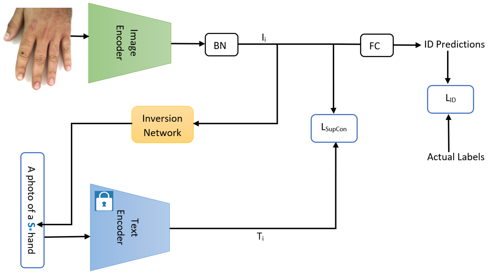
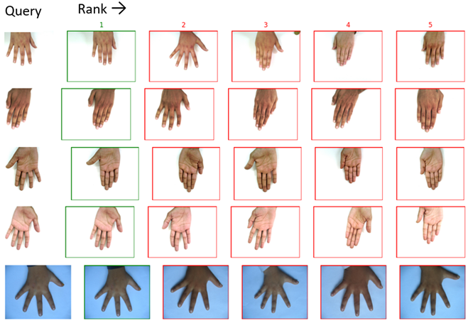

# CLIP-HandID: Vision-Language Model for Hand-Based Person Identification

<!--
Code for the paper [CLIP-HandID: Vision-Language Model for Hand-Based Person Identification](conference or arXiv link) 
which has been published on [IPTA 2025](https://ipta-conference.com/ipta25/index.php).
-->

## Overview
This paper introduces a new approach to person identification based on hand images, designed specifically for criminal 
investigations. The method is particularly valuable in serious crimes like sexual abuse, where hand images are often the 
sole identifiable evidence available. Our proposed method, CLIP-HandID, leverages pre-trained foundational vision-language 
model, particularly CLIP, to efficiently learn discriminative deep feature representations from hand images given as 
input to the image encoder of CLIP using textual prompts as semantic guidance. We propose to learn pseudo-tokens that 
represent specific visual contexts or appearance attributes using textual inversion network since labels of hand images 
are indexes instead text descriptions. The learned pseudo-tokens are incorporated into textual prompts which are given 
as input to the text encoder of the CLIP to leverage its multi-modal reasoning to enhance its generalization for 
identification. Through extensive evaluations on two large, publicly available hand datasets with multi-ethnic 
representation, we show that our method substantially surpasses existing approaches.

The proposed CLIP-HandID structure is shown below.



The qualitative results of our proposed method are also shown below.



Some qualitative results of our method using query vs ranked results retrieved from gallery are shown in the Fig. above. 
From top to bottom row are right dorsal of 11k, left dorsal of 11k, right palmar of 11k, left palmar of 11k and HD 
datasets. The green and red bounding boxes denote the correct and the wrong matches, respectively.


## Installation

Git clone this repo and install dependencies to have the same environment configuration as the one we used. Note that we trained 
the models on a single NVIDIA GeForce RTX 2080 Ti GPU.

```
git clone https://github.com/nathanlem1/CLIP-HandID.git.git
cd CLIP-HandID
pip install -r requirements.txt
```

You also need to install [CLIP](https://github.com/openai/CLIP) for CLIP zero-shot evaluation, particularly for running 
`eval_query_gallery_clip_zeroshot.py`. 

## Data Preparation
We use [11k](https://sites.google.com/view/11khands) and [HD](http://www4.comp.polyu.edu.hk/~csajaykr/knuckleV2.htm) datasets 
for our experiments.

1. To use the [11k](https://sites.google.com/view/11khands) dataset, you neet to create `11k` folder under the `CLIP-HandID` folder. Download dataset to `/CLIP-HandID/11k/` from [11k](https://sites.google.com/view/11khands) and extract it. You need to download both hand images and metadata (.csv file). The data structure will look like:

```
11k/
    Hands/
    HandInfo.csv
```
Then you can run following code to prepare the 11k dataset: 

```
python prepare_train_val_test_11k_r_l.py
```

2. To use the [HD](http://www4.comp.polyu.edu.hk/~csajaykr/knuckleV2.htm) dataset, you neet to create `HD` folder under the `CLIP-HandID` folder. Download dataset to `/CLIP-HandID/HD/` from [HD](http://www4.comp.polyu.edu.hk/~csajaykr/knuckleV2.htm) and extract it. You need to download the original images. The data structure will look like:

```
HD/
   Original Images/
   Segmented Images/
   ReadMe.txt
```
Then you can run following code to prepare the HD dataset: 
```
python prepare_train_val_test_hd.py
```


## Train
To train on the 11k dorsal right dataset, you need to run the following code on terminal:  

```
python train_handID.py --data_dir ./11k/train_val_test_split_dorsal_r --f_name ./model_11k_d_r --data_type 11k --backbone_name ViT-B/16 --m_name clip_hand_vit --is_learn_tokens
```

Please look into the `train_handID.py` for more details. You need to provide the correct dataset i.e. right dorsal of 11k, left 
dorsal of 11k, right palmar of 11k, left palmar of 11k or HD dataset. You may need to change the name of `Original Images` in 
`HD/Original Images` to `Original_Images` so that it will look like `HD/Original_Images`. This helps to use it on command line 
to train the model on `HD` dataset. Thus, to train on the HD dataset, you need to run the following code on terminal:

```
python train_handID.py --data_dir ./HD/Original_Images/train_val_test_split --f_name ./model_HD --data_type HD --backbone_name ViT-B/16 --m_name clip_hand_vit --is_learn_tokens
```
You need to change vision transformer `ViT-B/16` to ResNet50 `RN50` CLIP backbone model to use ResNet50 based CLIP model for image encoder. 
You also need to change the output folder name `clip_hand_vit` to `clip_hand_rn50` when using `RN50` backbone CLIP image encoder model.  


## Evaluate

1. To evaluate using the CLIP pretrained model in zero-shot fashion, for instance, on the 11k dorsal right dataset, you need to run the following 
code on terminal:

```
python eval_query_gallery_clip_zeroshot.py --test_dir ./11k/train_val_test_split_dorsal_r --f_name ./model_11k_d_r --backbone_name ViT-B/16 
```
You need to change vision transformer `ViT-B/16` to ResNet50 `RN50` CLIP backbone model to use ResNet50 based CLIP model for image encoder. 
You also need to change the output folder name `clip_hand_vit` to `clip_hand_rn50` when using `RN50` backbone CLIP image encoder model.  


2. To evaluate using the trained CLIP-HandID model, for instance, on the 11k dorsal right dataset, you need to run the following code on terminal:

```
python eval_query_gallery_handID.py --test_dir ./11k/train_val_test_split_dorsal_r --f_name ./model_11k_d_r --m_name clip_hand_vit
```

Please look into the `eval_query_gallery_handID.py` for more details. In case you are using a command line, you can run on the HD dataset
after changing the name of `Original Images` in `HD/Original Images` to `Original_Images` so that it will look like `HD/Original_Images`, 
and then run the following code on terminal:

```
python eval_query_gallery_handID.py --test_dir ./HD/Original_Images/train_val_test_split --f_name ./model_HD --m_name clip_hand_vit
```
You also need to change the output folder name `clip_hand_vit` to `clip_hand_rn50` when using `RN50` backbone CLIP image encoder model.

3. In addition, you can use `query_ranking_result_demo.py` to produce qualitative results.


<!---
## Citation

If you use this code for your research, please cite our paper.

```
@InProceedings{Nathanael_ICPR2022,
author = {Baisa, Nathanael L. and Williams, Bryan and Rahmani, Hossein and Angelov, Plamen and Black, Sue},
title = {Multi-Branch with Attention Network for Hand-Based Person Recognition},
booktitle = {The 26th International Conference on Pattern Recognition (ICPR)},
month = {Aug},
year = {2022}
}
```
-->
